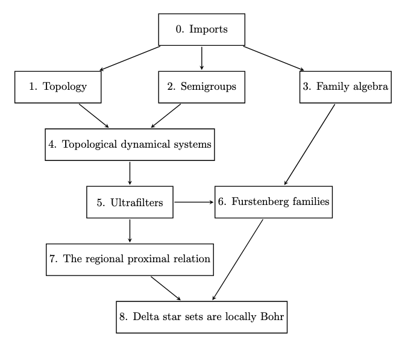

# Regional proximality for semigroup actions and the local dynamical structure of delta* sets

A Lean 4 formalization of all of the results and underlying machinery of the two papers below. Both papers jointly authored by Angelina Blahodatna, Lauren Detmold, Daniel Glasscock, and Anh N. Le with support from the US National Science Foundation under a LEAPS Grant, Award Number 2418589. See below for affiliation and contact information.

There are two associated Palomar submissions, one for each of the papers: (to be updated).

## Papers and abstracts

### The regionally proximal relation for commutative semigroup actions

- [The regionally proximal relation for commutative semigroup actions](link)

Abstract: The regionally proximal and equicontinuous structure relations are fundamental relations in topological dynamics that capture the equicontinuous behavior in a topological dynamical system and its factors. For minimal actions of abelian groups, these relations are known to be equivalence relations and are known to coincide. In this paper, we generalize these facts to semigroup actions: for minimal actions of commutative semigroups, the regionally proximal and equicontinuous structure relations are equivalence relations and the two coincide. We also develop the machinery of natural extensions for commutative semigroup actions that act by surjections, concluding that the maximal equicontinuous factor of a minimal action of a commutative semigroup is the same as the maximal equicontinuous factor of the group action into which it embeds.

### The local dynamical structure of delta* sets via a new Furstenberg family algebra

- [The local dynamical structure of difference sets via a new Furstenberg family algebra](link)

Abstract: In this paper, we strengthen the connection between the combinatorics of difference sets and the dynamics of group rotations. Our main result shows that sets which have non-empty intersection with all difference subsets of a commutative semigroup possess local Bohr structure. This generalizes results of Bergelson, Furstenberg, and Weiss and Host and Kra from the integers to arbitrary commutative semigroups. We accomplish this by utilizing a recent result showing that the regionally proximal relation is an equivalence relation for minimal actions of commutative semigroups and by describing a new, DeMorgan-type algebra on Furstenberg families that allows for efficient manipulation and computation.

See the Organization section below for more detailed information.

## Math in this formalization

Beyond the results in the papers, the formalization in this repository includes the following machinery:

- the topological dynamics of actions of discrete semigroups on compact Hausdorff spaces by continuous maps, including structures such as factors, ICERs, quotient systems, and natural extensions, and special dynamical properties such as minimality, semisimplicity, distality, proximality, and equicontinuity;
- ultrafilters as a tool in topological dynamics, including, for a discrete semigroup S, $\beta S$ as a universal S-system and the induced action of $\beta S$ on an S-system, and the link between algebraic and dynamical properties of ultrafilters (ideals and subsystems, minimal ultrafilters and minimal systems, and idempotency);
- Furstenberg families, including concrete families (syndetic, thick, Delta, IP, central, dynamically central syndetic, Bohr_0, sets of Bohr recurrence) and the containment and algebra between them (via dual, meet, and join).

## Organization

The code in this repository is organized as follows. The main results from the introductions are stated and proved in the files: Delta_main_theorems.lean and RP_main_theorems.lean. The accompanying machinery is split into 9 folders with the following logical dependency:

0. **Imports**  
   Imports from Mathlib used in the formalization
1. **Topology**  
   Basic topology facts not available in Mathlib
2. **Semigroups**  
   Basic semigroup facts not available in Mathlib
3. **Family algebra**  
   Abstract Furstenberg family structures, definitions, and theorems
4. **Topological dynamical systems**  
   The main body of machinery around dynamical systems, as outlined above
5. **Ultrafilters**  
   The main body of machinery around ultrafilters, as outlined above
6. **Furstenberg families**  
   Specific families and the relations and machinery around them
7. **The regionally proximal relation**  
   The main results of the "regionally proximal" paper
8. **Delta star sets are locally Bohr**  
   The main results of the "delta*" paper

## Autoformalization

Parts of this formalization were written with the help of AI-based coding agents, including Claude Opus 5 and ChatGPT. Specifically:

- definitions, theorems, and proofs in the files `TP_Cylinders.lean` and `FF_Pontryagin.lean` were written by Claude Opus 5;
- definitions, theorems, and proofs in the file `FF_CXX.lean` were written by ChatGPT 5.6 Sol;
- some definitions and most proofs in the file `RP_Nat_ext.lean` were written by Claude Opus 5;
- approximately 20 proofs of theorems scattered throughout the project were written by Claude Opus 5.

ChatGPT 5.6 Sol and Luna were used to help with tactics at particular places in proofs, diagnose compilation errors, and search Mathlib. Beyond these specific callouts, all code was written by hand.  In particular, all definition and theorem statements outside of the specific files mentioned above were written by hand.

All submitted code was reviewed by the authors and checked by the Lean elaborator and compiler. The authors are responsible for the mathematical content of the formalization, the correctness of the statements, and the interpretation of the resulting code. A more detailed accounting of our use of coding agents can be found included in the Palomar submissions at the links above.

## Requirements

- Lean 4.34.0-rc2
- Mathlib 082e2d37e8b0463410cdb532e111cd43d5a66174

The `lean-toolchain` and `lakefile.toml` files contain the authoritative version information.

## References

- [The regionally proximal relation for commutative semigroup actions](link)
- [The local dynamical structure of difference sets via a new Furstenberg family algebra](link)
- [Palomar 1](link)
- [Palomar 2](link)

## License

This project is licensed under the MIT License. See the [LICENSE](LICENSE)
file for the complete license text.

## Citation

If you use this formalization, please cite:

> Angelina Blahodatna, Lauren Detmold, Daniel Glasscock, and Anh N. Le. Regional Proximality for Semigroup Actions and the Local Dynamical Structure of Delta* Sets: A Lean Formalization. GitHub repository LINK, 2026.

## Contributing

Questions, bug reports, and suggestions are welcome. Please email Daniel Glasscock at [daniel_glasscock@uml.edu](mailto:daniel_glasscock@uml.edu).

When reporting a problem, please include the version of Lean and Mathlib you are using, the output of `lake build`, and a minimal example that reproduces the issue, if possible.

## Author affiliations and contact

Angelina Blahodatna, U. Massachusetts Lowell, [angelina_blahodatna@student.uml.edu](mailto:angelina_blahodatna@student.uml.edu)  
Lauren Detmold, U. Massachusetts Lowell, [lauren_detmold@student.uml.edu](mailto:lauren_detmold@student.uml.edu)  
Daniel Glasscock, U. Massachusetts Lowell, [daniel_glasscock@uml.edu](mailto:daniel_glasscock@uml.edu)  
Anh N. Le, U. Denver, [anh.n.le@du.edu](mailto:anh.n.le@du.edu)

## Support

The authors gratefully acknowledge support from the US National Science Foundation under a LEAPS Grant, Award Number 2418589.